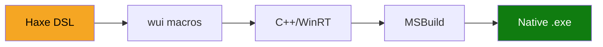

# wui

**Write native WinUI 3 Windows apps in Haxe.**

wui is a framework that compiles Haxe code into native WinUI 3 desktop applications. Inspired by [Pign/sui](https://github.com/Pign/sui) (which targets SwiftUI), wui brings the same declarative approach to Windows.

## How it works



You write a declarative UI in Haxe:

```haxe
class MyApp extends wui.App {
    override function appName():String return "MyApp";

    override function body():View {
        return new VStack([
            new Text("Hello from Haxe!")
                .font(TitleLarge)
                .foregroundColor(AccentColor)
                .padding(),
            new Button("Click me")
        ]);
    }
}
```

The wui macro system analyzes this at compile time and generates imperative C++/WinRT code:

```cpp
winrt_controls::StackPanel panel_0;
panel_0.Orientation(winrt_controls::Orientation::Vertical);

winrt_controls::TextBlock text_1;
text_1.Text(L"Hello from Haxe!");
text_1.FontSize(40);
text_1.FontWeight(winrt::Windows::UI::Text::FontWeight{ 600 });
text_1.Foreground(wui::runtime::accentBrush());
text_1.Padding(wui::runtime::uniformThickness(12));
panel_0.Children().Append(text_1);

winrt_controls::Button btn_2;
btn_2.Content(winrt::box_value(L"Click me"));
panel_0.Children().Append(btn_2);
```

MSBuild compiles this into a self-contained native `.exe` with all WinUI 3 runtime DLLs.

## Key features

- **Haxe DSL** — Type-safe, declarative UI with macros, pattern matching, and generics
- **Native WinUI 3** — Real Windows controls, not web views or wrappers
- **Pure C++** — Both hxcpp and C++/WinRT are C++, no cross-language bridge
- **Self-contained** — Single output directory with all DLLs, ready to run
- **22 components** — Text, Button, VStack, HStack, ListView, NavigationView, and more
- **21 modifiers** — Padding, font, color, opacity, corner radius, and more
- **Reactive state** — `@:state` macro, `State<T>`, `Binding<T>`, `StateAction`

## Quick start

```bash
wui init MyApp
cd MyApp
wui build
wui run
```

See the [Getting Started](getting-started.md) guide for full setup instructions.
