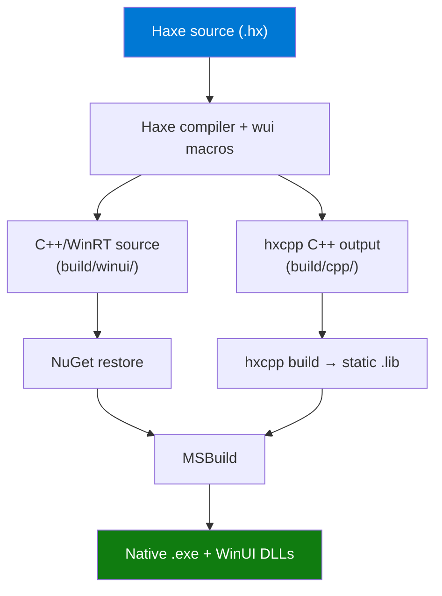

# Architecture

wui compiles Haxe source to a native WinUI 3 `.exe` with no runtime bridge. This page explains how.

## The key insight

Haxe's `hxcpp` target compiles to C++. WinUI 3 apps are also C++ (via C++/WinRT). Since both sides are native C++, wui generates code that links them together at the C++ level -- subscriber lambdas call WinUI control setters directly, in the same process, with no serialization or inter-process communication.

## Compilation pipeline



The macros generate several files into `build/winui/`:

```
 build/winui/
       App.h / App.cpp          <-- Application entry point
       MainWindow.h / .cpp      <-- Generated UI code
       WuiRuntime.h             <-- Runtime helpers
       <AppName>.vcxproj        <-- MSBuild project
       packages.config          <-- NuGet dependencies
       pch.h / pch.cpp          <-- Precompiled headers
       App.xaml / App.idl       <-- WinRT class registration
       app.manifest             <-- DPI awareness
       |
       v
 [NuGet restore]  -->  Windows App SDK, CppWinRT, SDK Build Tools
       |
       v
 [MSBuild]  -->  native .exe (build/winui/Debug/<AppName>.exe)
```

### Step 1: Haxe compilation

Running `haxe build.hxml` does two things:

1. **hxcpp codegen** -- Haxe compiles your `.hx` files to C++ in `build/cpp/`. This includes your `App` subclass, state variables, data models, and any business logic.

2. **WinUIGenerator macro** -- registered via `--macro wui.macros.WinUIGenerator.register()`, this macro runs after the Haxe typing phase completes. It:
   - Finds all `App` subclasses.
   - Analyzes the `body()` method's typed AST to build a `ViewNode` tree.
   - Delegates to three sub-generators to emit C++/WinRT files.

### Step 2: hxcpp static library

The hxcpp output is compiled into a static `.lib` that can be linked by MSBuild.

### Step 3: NuGet restore

The generated `packages.config` lists three NuGet packages:

| Package | Purpose |
|---------|---------|
| `Microsoft.WindowsAppSDK` | WinUI 3 runtime and controls |
| `Microsoft.Windows.CppWinRT` | C++/WinRT projection headers |
| `Microsoft.Windows.SDK.BuildTools` | Windows SDK build tools (midl, rc, mt) |

### Step 4: MSBuild

The generated `.vcxproj` is a standard C++/WinRT project. MSBuild compiles the generated source, links the hxcpp static library and WindowsApp.lib, and produces a self-contained `.exe`.

---

## The macro system

Four macros work together during Haxe compilation:

### WinUIGenerator (orchestrator)

`wui.macros.WinUIGenerator` is the entry point. It registers two callbacks:

- `onAfterTyping` -- collects all classes that extend `wui.App`.
- `onAfterGenerate` -- calls the three sub-generators.

It also contains the AST analysis logic that walks the `body()` method's typed expression tree and builds a `ViewNode` tree. Each `ViewNode` captures:

```haxe
typedef ViewNode = {
    viewType:String,               // "StackPanel", "TextBlock", "Button", etc.
    children:Array<ViewNode>,
    modifiers:Array<ModifierData>,
    properties:Map<String, Dynamic>
};
```

The orchestrator handles:
- `new VStack(...)` / `new HStack(...)` / `new Text(...)` -- recognized by class name
- Modifier chains like `.padding(16).font(Title)` -- recognized as method calls on a View
- Temp variable resolution -- `var x = new VStack(...); return x;`
- Block expressions and returns

### UIBuilder (C++/WinRT code generation)

`wui.macros.UIBuilder` takes the `ViewNode` tree and generates imperative C++/WinRT code. For each node, it:

1. Declares a local variable of the corresponding WinUI type.
2. Sets properties (e.g., `textBlock.Text(L"Hello")`).
3. Applies modifiers (e.g., `panel.Margin(uniformThickness(12))`).
4. Generates children recursively and appends them.

Output files:
- `MainWindow.h` -- declares `BuildUI()` function.
- `MainWindow.cpp` -- implements `BuildUI()` with the generated imperative code.

Example generated code for a simple VStack with Text:

```cpp
winrt_controls::StackPanel panel_0;
panel_0.Orientation(winrt_controls::Orientation::Vertical);

winrt_controls::TextBlock text_1;
text_1.Text(L"Hello from Haxe!");
text_1.FontSize(40);
text_1.FontWeight(winrt::Windows::UI::Text::FontWeight{ 600 });

panel_0.Children().Append(text_1);
return panel_0;
```

### ProjectGenerator (MSBuild project)

`wui.macros.ProjectGenerator` generates the build infrastructure:

| File | Purpose |
|------|---------|
| `<AppName>.vcxproj` | MSBuild project with C++20, NuGet imports, file list |
| `packages.config` | NuGet package versions |
| `pch.h` | Precompiled header with all WinUI/WinRT includes |
| `pch.cpp` | PCH source |
| `app.manifest` | DPI awareness, Windows 10/11 compatibility |

The `.vcxproj` uses:
- `v143` platform toolset (VS 2022)
- C++20 language standard
- `DISABLE_XAML_GENERATED_MAIN` (wui provides its own `wWinMain`)
- Self-contained deployment (`WindowsAppSDKSelfContained = true`)

### BridgeGenerator (application bootstrap)

`wui.macros.BridgeGenerator` generates the WinRT application class and runtime helpers:

| File | Purpose |
|------|---------|
| `App.h` | WinRT `App` class declaration |
| `App.cpp` | `OnLaunched` (creates window, sets size, calls `BuildUI`), `wWinMain` entry point |
| `App.xaml` | XAML application definition (loads `XamlControlsResources`) |
| `App.idl` | MIDL 3.0 definition for the App runtime class |
| `WuiRuntime.h` | Helper functions: color brushes, thickness/corner-radius, string conversion, UI thread dispatch |

The `App.cpp` entry point:

1. Initializes a single-threaded COM apartment.
2. Creates the WinRT `Application`.
3. In `OnLaunched`, creates a `Window`, sets its title and size, calls `MainWindow::BuildUI()` to get the root UI element, sets it as the window content, and activates the window.

---

## Why no bridge?

Traditional frameworks that cross language boundaries (e.g., JS to native) need a bridge: serialization, message passing, async dispatch. wui avoids all of this because:

1. **hxcpp compiles to C++** -- your Haxe code becomes native C++ via hxcpp.
2. **WinUI 3 is C++/WinRT** -- the UI layer is also native C++.
3. **Same process, same language** -- state subscriber lambdas can directly call `textBlock.Text(newValue)` because both sides are compiled C++ in the same binary.

The only "bridge" is a compile-time one: macros that translate Haxe view descriptions into C++/WinRT code.

---

## XAML and IDL

XAML is used only for the `Application` class registration (`App.xaml`). It loads the WinUI control resources (`XamlControlsResources`). All actual UI is built imperatively in C++ -- no XAML pages, no XAML data binding.

IDL (MIDL 3.0) is used only for the `App.idl` file, which registers the `App` runtime class with the WinRT type system. This is required by the WinUI 3 application model.

---

## Self-contained deployment

The generated `.vcxproj` sets `WindowsAppSDKSelfContained=true` and `WindowsPackageType=None`. This means:

- The output is a plain `.exe` (not an MSIX package).
- Windows App SDK runtime DLLs are copied alongside the `.exe`.
- No Microsoft Store packaging required.
- Runs on any Windows 10 (10.0.22621+) or Windows 11 machine.

---

## Platform APIs

The `wui.platform.Windows` class exposes window-level settings:

| Property | Type | Default | Description |
|----------|------|---------|-------------|
| `extendIntoTitleBar` | `Bool` | `false` | Extend content into the title bar area |
| `titleBarColor` | `Null<String>` | `null` | Custom title bar color (ARGB hex) |
| `showMinimize` | `Bool` | `true` | Show minimize button |
| `showMaximize` | `Bool` | `true` | Show maximize button |
| `minWidth` | `Int` | `320` | Minimum window width |
| `minHeight` | `Int` | `240` | Minimum window height |
